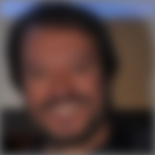
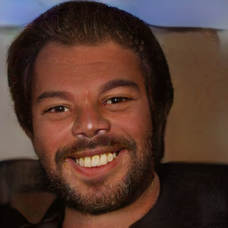
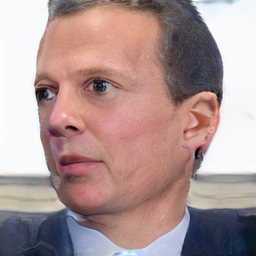
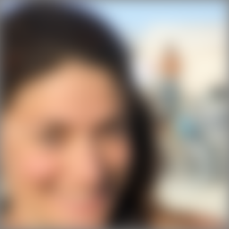
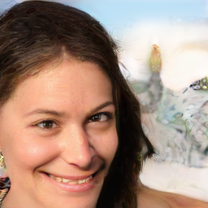
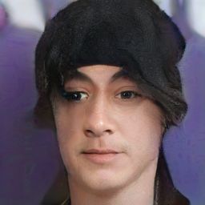
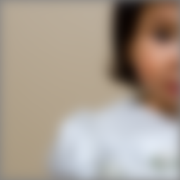
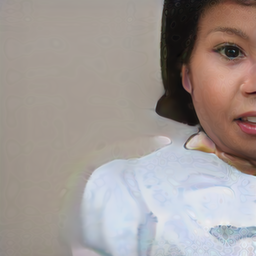
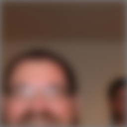
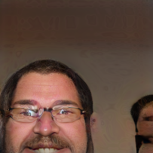

# Pixel2StyleGAN3  

<table> 
  <tr>
    <td> </td>
    <td> </td>
    <td> </td>
    <td> </td>
    <td> </td>
    <td> </td>
  </tr>
  <tr>
    <td> </td>
    <td> </td>
    <td> </td>
    <td> </td>
    <td> </td>
    <td> </td>
  </tr>
</table>  
 
#### Pix2StyleGAN3: Extended StyleGAN3 Architecture for Expressive Feature Exploration and Exploitation  

We present a new framework that extends StyleGAN3 architecture for real-time image-to-image translation tasks. First, we propose an appended encoder network with skip connections inserted directly into the StyleGAN3 generator, allowing the translation preserves more fine details than a regular encoder-decoder. By leveraging state-of-the-art generator architecture, our approach solves a variety of image-to-image translation tasks while maintaining the image quality and the internal behaviour of StyleGAN3. Next, after demonstrating the framework is lightweight enough to run real-time inference, we propose implementing our framework on network bending, which is an approach for grouping and manipulating features in semantically meaningful ways to create divergence. 
