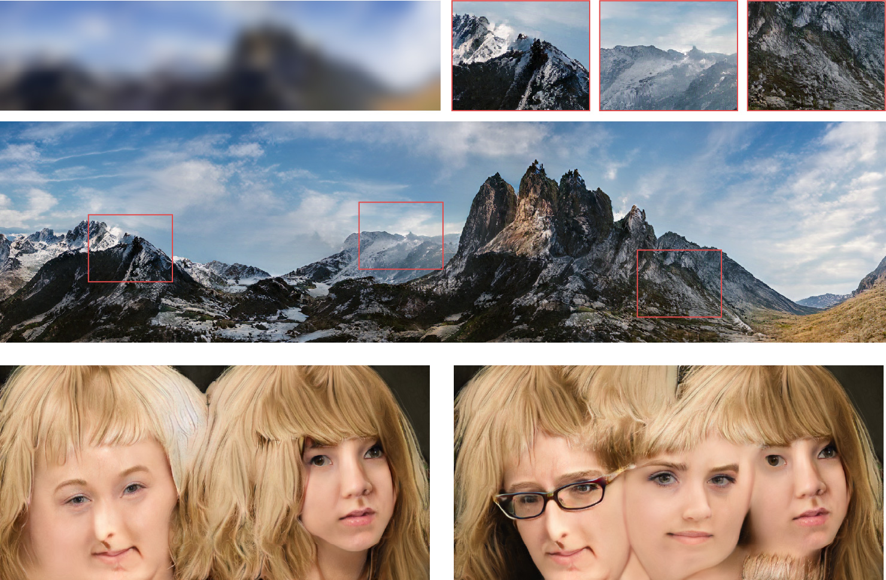

# pixel2StyleGAN3  

 
#### Expandable StyleGAN3 Canvas for Image-to-image Translation and Expressive Feature Exploration   

We present a new framework for real-time feature exploration and manipulation using style-based image-conditional generative adversarial networks. Our framework follows previously introduced [StyleGAN3](https://github.com/NVlabs/stylegan3) architecture, extends it for image-to-image translation tasks by appending a feature extraction encoder that creates low-level skip connections to the generator. We first demonstrate that our framework solves a variety of image-to-image translation tasks while maintaining the image quality and the internal behaviour of StyleGAN3. Our approach also induces an extendable canvas that can be trained on a lower resolution and later expanded to a larger resolution. Next, implement our framework on network bending, and build a graphic interface for real-time interaction with the model's internal features. Finally, we conduct qualitative human opinion studies to evaluate its usability in the creative context, and demonstrate its potential to broaden the possibility for expressive outcomes to emerge.   

## Live Demo  
Motivated by active divergence ([Berns and Colton, 2020](http://computationalcreativity.net/iccc20/papers/164-iccc20.pdf)), we propose an alternative approach to image-to-image translation that allows the features to be enlarged and interpolated after the network is trained. This provides an extendable generation canvas and significantly broadens the possibility for creative outcomes.

