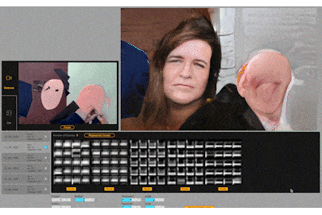
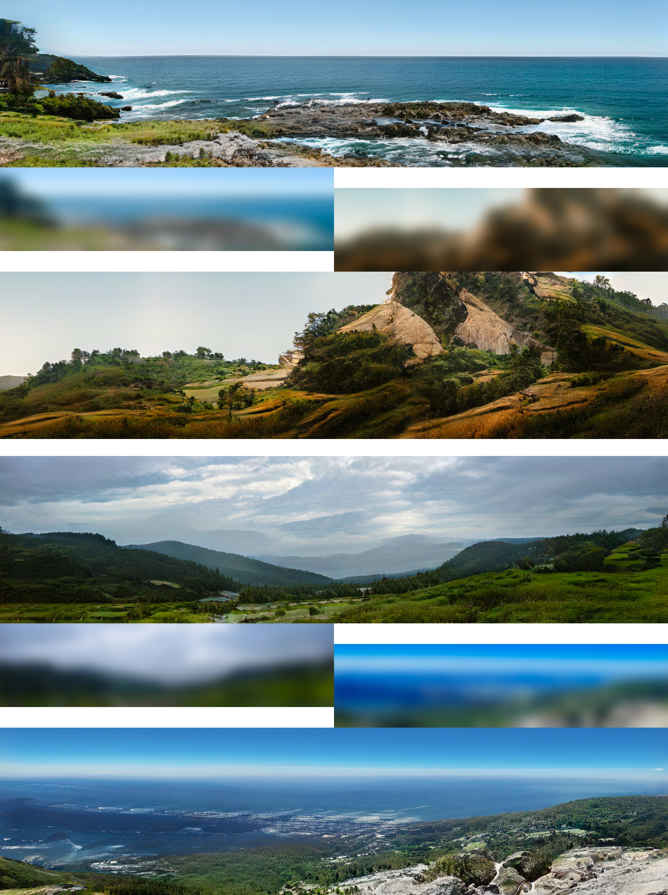
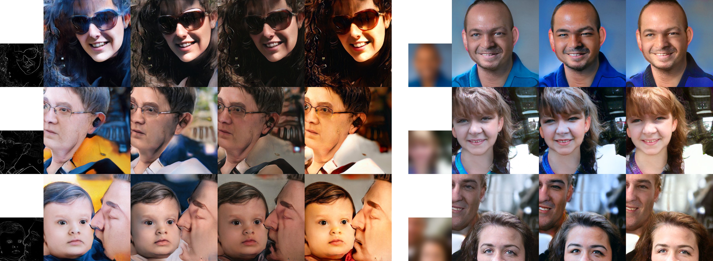
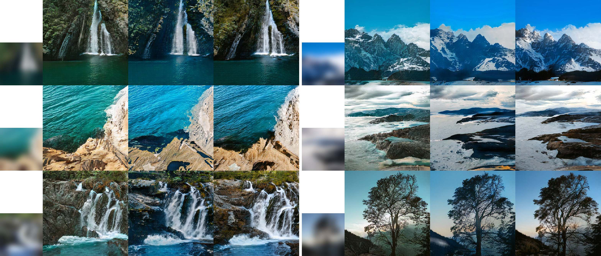
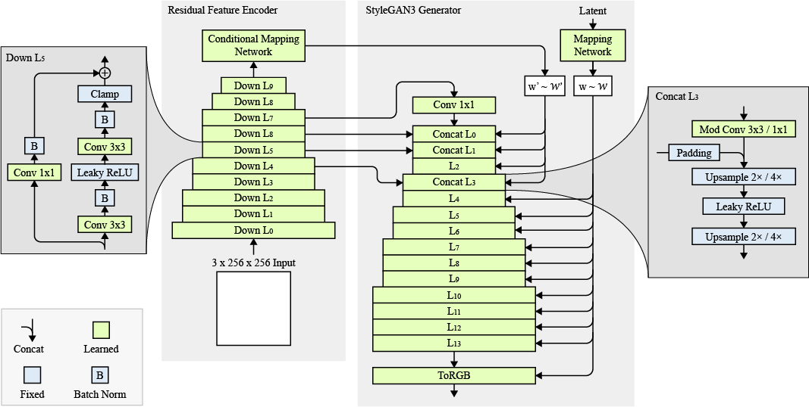

# StyleGAN-Canvas   

  


<a href="https://colab.research.google.com/github/jasper-zheng/pix2styleGAN3/blob/main/train_pix2stylegan3-r.ipynb"></a>  

 
#### StyleGAN-Canvas: Augmenting StyleGAN3 for Real-Time Human-AI Co-Creation  

Shuoyang Zheng (Jasper)  

[Paper](https://github.com/jasper-zheng/pix2styleGAN3/blob/main/msc_thesis_jasper.pdf)  

In this paper, we propose bridging the gap between StyleGAN3 and human-AI co-creative patterns by augmenting the latent variable model with the ability of image-conditional generation. We modify the existing generator architecture in StyleGAN3, enabling it to use high-level visual ideas to guide the human-AI co-creation. The resulting model, StyleGAN-Canvas, can solve various image-to-image translation tasks while maintaining the internal behaviour of StyleGAN3. We deploy our models to a real-time graphic interface and conduct qualitative human subject studies. We use the mixed initiative generative AI interfaces (MIGAI) framework to frame our findings and present a preliminary evaluation of our models’ usability in a generic co-creative context.

## Overview  
Motivated by active divergence ([Berns and Colton, 2020](http://computationalcreativity.net/iccc20/papers/164-iccc20.pdf)), we propose an alternative approach to image-to-image translation that allows the features to be enlarged and interpolated after the network is trained. This provides an extendable generation canvas and significantly broadens the possibility for creative outcomes.

Deploying the model to real-time interface: [real-time-flask-model](https://github.com/jasper-zheng/realtime-flask-model)  

## Applications  

### Expandable Canvas  

The model can be trained on a lower resolution and later expand to a larger canvas. The deblurring model is trained on 512x512 images and later expanded to 512x2048.  



### Generic image-to-image translation tasks

#### Deblurring and Edge-to-Faces on FFHQ  


#### Deblurring on LHQ  


## Requirements  

* 64-bit Python 3.8 and PyTorch 1.9.0 or later.   
* CUDA toolkit 11.1 or later.  
* GCC 7 or later (Linux) or Visual Studio (Windows) compilers.  
* Python libraries: see [requirements.txt](./requirements.txt) for exact library dependencies:  
  * `pip install -r requirements.txt`

## Getting Started  

Our models build upon StyleGAN3-T and StyleGAN3-R, the translational and rotational equivariant configuration of StyleGAN3. 

Stick to the [training configurations](https://github.com/NVlabs/stylegan3/blob/main/docs/configs.md) in StyleGAN3, and replace the `--cfg` with `--cfg=pix2stylegan3-t` or `--cfg=pix2stylegan3-r` to train the image-to-image model:  

```python
python train.py --outdir=OUT_DIR --cfg=pix2stylegan3-r --data=DATA_DIR \
                --gpus=1 --batch=32 --gamma=8 --cbase=16384 \
                --batch-gpu=32 --snap=20
```   

### Weigh the Loss Parameters  

Default target loss function is a combination of pixel-wise L2 distance and a perceptual loss (extracted by pre-trained VGG19 network), weighed to 1/1. However, in some cases you might want to change their weights by passing `--euclidean=1` or `--perceptual=1` and scale it with a constant.  


## Customise Pre-process Pipeline  

The blurring / Canny edge detector function in implemented in the `Preprocess` class in [training_loop.py](./training/training_loop.py). Edit the code for customised pre-process pipeline.

```python

class Preprocess(torch.nn.Module):
    def __init__(self, blur_sigma = 21, out_size = 256, device = torch.device('cuda')):
        super().__init__()
        self.device = device
        self.out_size = out_size
        blur_size = np.floor(blur_sigma * 3)
        self.f = torch.arange(-blur_size , blur_size + 1, device=device).div(blur_sigma).square().neg().exp2()
        
    @torch.no_grad()
    def preprocess_to_conditions(self, img_tensor):
        '''
        parameter: 
            img_tensor: [-1,1]
        return: 
            img_tensor: [-1,1]
        '''
        img_tensor = torch.nn.functional.interpolate(img_tensor, size = (self.out_size,self.out_size), mode='bilinear')
        img_tensor = torch.nn.functional.pad(img_tensor, (30,30,30,30), 'reflect')
        img_tensor = upfirdn2d.filter2d(img_tensor, self.f / self.f.sum())
        img_tensor = torch.nn.functional.pad(img_tensor, (-30,-30,-30,-30))
        
        return img_tensor
        
```


## Rational  
  

The proposed architecture includes an appended encoder network facilitating feature extraction and the StyleGAN3 mapping and synthesis network. The encoder is based on a U-net architecture with standard ResNet backbone, encoding an image into a 512-dimensional latent vector. Meanwhile, it creates skip connections that directly map features from the encoder into the StyleGAN3 synthesis network to preserve locality bias. We found that adding skip connections between only lower-level layers (i.e. feature maps with smaller resolution) is sufficient for it to shuttle precise features while preserving the internal behaviour of StyleGAN3 (i.e. encode phase information instead of signal magnitudes).  

In addition, as StyleGAN3 replaced the first generator layer with a frequency sampler with Fourier features to define a spatially infinite map, and therefore facilitate translation and rotation of the input, however, we propose extracting the first generator layer directly from the encoder, allowing the generator to inherit exact sub-pixel position. We show results from models with this architecture trained for a variety of image-to-image translation tasks while maintaining the image quality of StyleGAN3.   

## Credits   

**Alias-Free Generative Adversarial Networks**  
https://github.com/NVlabs/stylegan3   

**Network Bending**  
https://github.com/terrybroad/network-bending   

**pix2pixHD**  
https://github.com/NVIDIA/pix2pixHD  

**Flickr-Faces-HQ Dataset (FFHQ)**  
https://github.com/NVlabs/ffhq-dataset  

**Landscapes High-Quality (LHQ)**  
https://universome.github.io/alis.html  

